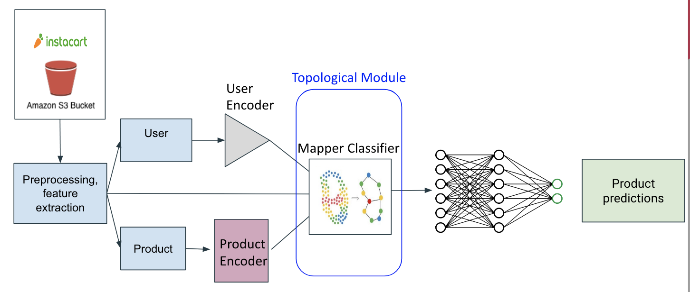
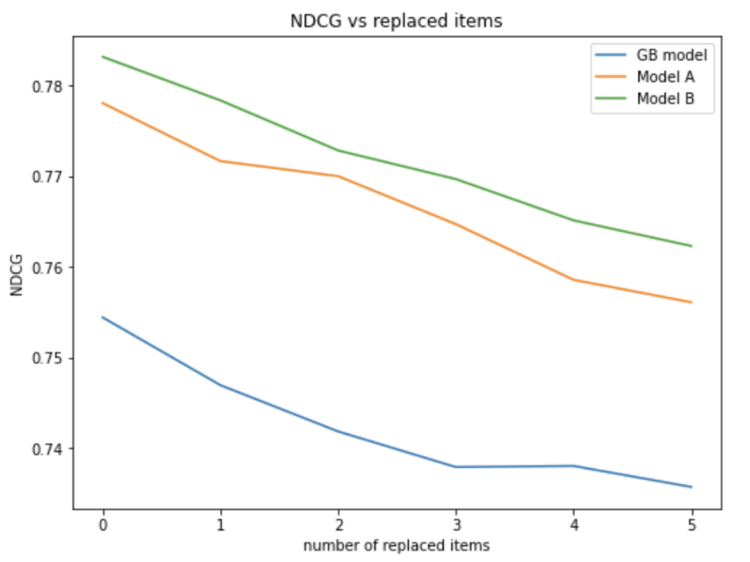

# top-choice

## INTRODUCTION

Ever misclick on an ad, only to receive similar ads again and again? Or 
maybe your friend asks you to order him some junk food on your 
online grocery account, where you normally only order healthy foods, 
and now you are served bad recommendations?  Product recommendation systems
can be oversensitive to outlier orders, which we can think of as noise in the
data the system uses to find user preferences.  This can lead to user frustration.

My goal is to develop a product recommendation system which more robust to these outliers.  My approach is based on [topological 
data analysis.](https://en.wikipedia.org/wiki/Topological_data_analysis)

The author of the repo is Brian Willett (bmwillett1 at gmail).

## BACKGROUND

A product recommendation system is an algorithm which determines for each user a set
of products or services which they would like to purchase or interact with.  Typically these
rely on a large dataset of users and products, for example, a history of
past interactions between users and products.  A common approach to this problem is
to use a machine learning algorithm trained on this dataset.  In particular, 
modern approaches often use neural networks and deep learning techniques to 
achieve impressive accuracy.

A potential pitfall of these techniques occurs when a user has some behavior that
lies outside their normal preferences.  The recommendation system may then be led to suggest products based on 
this behavior that are not desired by the user.  These outliers can be interpreted as 
"noise" in the user-product dataset, and it is desirable for the recommendation algorithm to 
be somewhat robust against this noise.

Many techniques have been developed for improving the performance of machine-learning
algorithms on noisy data.  In particular, topological data analysis (TDA) uses mathematical analysis
of patterns in data to extract features of data robust to small variations such as noise.  In 
particular, we will be interested in the Mapper-Classifier algorithm (MCA) of [arXiv:1910.08103](https://arxiv.org/pdf/1910.08103.pdf), 
which uses the concept of a Mapper graph from TDA to achieve improved robustness in image classification.  We will apply this algorithm to determine which products a user is likely to be interested in.
 
In this repo we implement some models with and without the MCA to evaluate
the performance of the recommendation systems in the presence of noise.  Concretely, we will
focus on the [Instacart dataset](https://www.instacart.com/datasets/grocery-shopping-2017).  Our task will be
to predict what products a user reorders given their previous orders.

## MODELS

### Main models



We develop models in a modular fashion by first creating the following components:

- **User latent models:** produces a latent vector depending only on the user data.  In principle
this and other latent models can be customized and used in the full models below.  Here we use an
autoencoder based on collaborative filtering.
- **Product latent model:** produces a latent vector depending only on the product data.  Our main
latent model here involves applying word2vec to the sequence of orders to group products
that are typically bought together, along with a tf-idf analysis of the words appearing
in product names
- **Feature model:** directly extract features from the order data.  Here we extract features
such as total product orders across all users, average position in cart, and so on.

From these models, we assemble our two main models:

- **Model A:** We concatenate the outputs of the three models above and
feed the result into a dense neural network.  In our case, the network
has two layers and a single output, which predicts for each user and
product pair whether the user will purchase that product in their next order

- **Model B:** Similar to Model A, except after concatenating the
models, we also feed the result into the mapper-classifier algorithm
to obtain additional topological features.  The result is also fed into
a dense neural network.

### Baseline models:

As baseline models for comparison, we consider simple models based on the following algorithms:

- Random model (predicts reorders randomly)
- Logistic regression
- Random Forest
- LGBoost 

## TESTS

We test models on basic classification metrics, such as accuracy, precision, recall, and f1 score.  In
addition, the normalized discounted cumulative gain (NDCG) is a useful measure
of how high in the predicted rankings the actual products appear.

In addition to performing these metrics on the original dataset, we test
robustness, or performance in the presence of spurious products, as follows. 
We perform adversarial tests by randomly changing some products in a user's prior
order history and seeing how model performance suffers. 

## RESULTS

Here we show a plot showing the performance of the two main models and 
the gradient boost (LGboost) baseline model on the robustness tests



We see the model with topological encoding (Model B) performs slightly better than the
non-topological model (Model A), as well as the baseline gradient boost model (GB model), as we replace
items in the robustness test.  These results are suggestive, but further study is needed
to conclusively determine the effectiveness of this approach.

## DIRECTORY STRUCTURE

See above for more details on the models.

```
.
├── README.md               - this readme file
├── requirements.txt        - package requirements
├── lib
│   ├── data_class.py       - definition of main dataset class
│   ├── mapper_class.py     - mapper classifier implementation
│   ├── process_data.py     - helper function to process data
│   └── tools.py            - general helper functions
├── models
│   ├── base_model.py       - base model class which others inherit
│   ├── baseline_models.py  - baseline models for comparison
│   ├── feature_models.py   - feature models
│   ├── latent_models.py    - user and product latent models
│   └── main_models.py      - main models
└── tests
    ├── mnist_tests.ipynb   - some tests of mapper classifier on MNIST dataset
    ├── run_unit_tests.py    - runs all unit tests
    └── runtests.py         - runs main accuracy and robustness tests
```

## SETUP


- To run tests in this repo:

```console
git clone https://github.com/bmwillett/topological-recommendations
pip install -r requirements.txt
python tests/runtests.py
```

> (PACKAGE COMING SOON!) 
>
> To install top-choice package:
>
> - In the command line, run:
> ```console
> pip install top-choice
> ```


